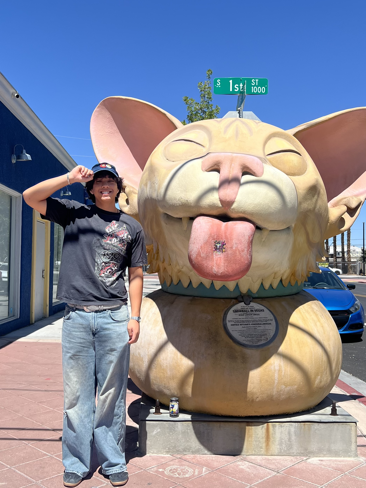

# Hi, I'm Zachary Huang!
Welcome to my user page. I'm a developer who loves bridging the gap between functional software and interactive design.
## Table of Contents
- [Hi, I'm Zachary Huang!](#hi-im-zachary-huang)
  - [Table of Contents](#table-of-contents)
  - [About Me](#about-me)
  - [My Philosophy](#my-philosophy)
  - [Tech \& Design Stack](#tech--design-stack)
  - [Current Goals](#current-goals)
  - [More Info](#more-info)
## About Me
I am currently studying Computer Science with a minor in Design at [UC San Diego](https://ucsd.edu/). I'm involved with the local tech and design community, currently working as a Software Developer for Design Co. 

Outside of the digital world, you can find me skateboarding around campus or exploring a local hiking trail in Southern California!

My skateboarding trick checklist:
- [x] Ollie
- [x] Manual
- [x] Shuv-it
- [x] Pop Shuv-it
- [] Frontside 180
- [] Kickflip

## My Philosophy
I believe the best applications are built with logic and creativity.

> "Design is not just what it looks like and feels like. Design is how it works." – Donald A. Norman

## Tech & Design Stack
Here are a few of the tools I most frequently use in my work:
* **Frontend Web Dev:** *React, Vite, HTML/CSS, JavaScript, Sass*
* **Design:** *Adobe Illustrator, Photoshop, Canva, Figma*

One of my favorite lines of code, is this true classic:
`console.log("Hello World!");`

## Current Goals
Here's an overview of what I'm working on this quarter:

1. Build responsive web components featuring custom CSS animations
2. Deepen my understanding of complex algorithms, programming techniques / conventions, and the process of software engineering. 
3. Build my social facilitation skills and knowledge of UCSD campus resources in preparation for Seventh College Fall Orientation, as an orientation leader.

## More Info
Wanna know my university PID? Checkout this private [text file](./PRIVATE.txt) file that I created for this assignment.